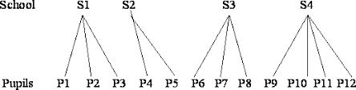

```{r setup, include=FALSE}
knitr::opts_chunk$set(echo = TRUE,
                      warning = FALSE)

ggplot2::theme_set(ggplot2::theme_bw())
library(tidyverse)
library(performance)
```

# What is multi-level modeling and why is it important?

Multi-level models (also known as linear mixed effects models, mixed models or hierarchical linear models) are a method of analysing data that is **nested**, or clustered within a group. 

Lots of data collected in psychology research has a hierarchical or nested structure. For example:

* data collected from students nested within classrooms within schools
* multiple time points collected for each participant.

<br>

***

```{r, out.width='70%', fig.align='center', echo = F}

```


```{r, include = F}
tab <- data.frame("Students in Schools"= c("School", "Classroom", "Student"),
                  "Measurements in Participants"= c("", "Participant", "Measurement"))
rownames(tab) <- c("Level 3", "Level 2", "Level 1")
tab
table <- knitr::kable(tab,
                      col.names = c("Students in Schools",
                                    "Measurements in Participants"),
                      align = "c")
```

<br>

*** 

```{r echo = F}
table
```

***

<br>


## Assumptions of Regression

<br>

* **Normality**: residuals are normally distributed
* **Homogeneity of variance (homoscedasticity)**: variance of residuals is constant across levels of predictor
* **Independence**: all data points are independent of one another

Clustered data violates this independence assumption. Data points collected from one participant or one school are more likely to be similar to each other than points from different individuals or schools and so we cannot claim the data points are independent.

Doing so means we under-estimate the standard error of our estimates and increase the chances of a Type 1 error, or false positive. 

## Advantages of multi-level models

Traditionally this type of data would have been analysed using a repeated measures ANOVA, which accounts for the fact that measurements within a group will be correlated. However, there are drawbacks to this approach:

* Needs complete data for each group or else the entire group will be deleted. This reduces power if there are many cases with missing data.
* Dependent variable must be continuous and independent variable must be categorical
* no information about magnitude or direction of effect sizes
* no individual coefficient estimates

These shortcomings can be overcome by using multi-level models.

* Handles missing data and unbalanced designs better. If an observation is missing, the other observations within the group can still be included and so this has less of an impact on the power than with an ANOVA.
* Groups with more missing cases have a weaker influence on the parameter estimates than groups with more cases.
* Can also be used with continuous predictors and a variety of types of response variables (e.g. categorical outcomes).
* Fitted model provides coefficient estimates that indicate the magnitude and direction of the effects of interest.

# Fixed and Random Effects


Mixed models are called *mixed* because they contain a mixture of what are known as fixed and random effects. The difference between these can be a little hard to get your head around at first but it's important to note that the difference often has little to do with the variables themselves, and more to do with the research design and question. 

Broadly, fixed effects are usually the variables of primary interest in the data. They are the variables that you expect to have an effect on the outcome variable and you wish to estimate what this effect is. For example, experimental group will be a fixed effect.

Random effects are grouping variables that you wish to control for in your analysis. You are not specifically interested in how these differ or influence the outcome variable but just want to account for the fact that there will be differences. For example, individual participants will be a random effect.
we can only generalise our fixed effects results to the levels within an experiment, but we can generalise from our random effects to levels beyond those that took part in our study.

# Example: Sleep Study

## Null model and ICC

This dataset shows the average reaction time per day (in milliseconds) for subjects in a sleep deprivation study. Let's say we are interested in the effect of number of days on reaction time. We have nested data because we have multiple measurement points for each participant. So we have a Level 2 variable, Subject, with a Level 1 variable of Reaction Time. 

We need the data to be in **long** format for this analysis, i.e. one row per observation. We can change from wide to long format using `pivot_longer()`. 

For example:

Say we got the data first in wide format like this:

```{r}
library(lme4)
sleepstudy_wide <- sleepstudy %>%
  select(Subject, Reaction, Days) %>%
  pivot_wider(names_from = Days,
              values_from = Reaction,
              names_prefix = "Day")

head(sleepstudy_wide)
```

We could convert it back to long format like this:

```{r}
sleep_study_long <-  sleepstudy_wide %>%
  pivot_longer(cols = Day0:Day9,
               names_to = "Day",
               values_to = "Reaction",
               names_prefix = "Day")

head(sleep_study_long)
```

Also note that if your variables are on very different scales, sometimes the model won't be able to converge. You can sometimes solve this by making sure your variables are on roughly the same scale, i.e. converting a block number variable to a percentage progress by dividing each block number by the total number of blocks.

We will use the `lme4` package in R for multi level models. 

```{r, message = FALSE}
library(lme4)
str(sleepstudy)
head(sleepstudy)

library(ggplot2)
ggplot(sleepstudy, aes(Subject, Reaction)) +
      geom_boxplot() + 
      geom_jitter(aes(colour = Subject), 
                  position = position_jitter(0.1))
```

Notice here we see two sources of variance: between participant variance and within participant (or residual) variance. Understanding and accounting for these different sources of variance is the key to understanding the principles behind multi-level models.

Before we look at the effect of any predictors on the outcome variable, we can work out the proportion of overall variance that is between individuals. This is known as the **ICC** (intra-class correlation coefficient).

<br>

$ICC = \frac{\text{between subject variance}}{\text{between subject variance + residual variance}}$

<br> 

To see how much of each type of variance we have, we can run a model with just a random intercept called a **variance components model** or **null model**:

 
```{r}
vcm <- lmer(Reaction ~ (1|Subject), sleepstudy)
summary(vcm)
```

This tells us that the between subjects variance is 1278 and the within (or residual) variance is 1959.

I.e., 1278/(1278 + 1959) = 39.5% of the variance is between participants.

We can calculate this using the `performance::icc` function

```{r}
performance::icc(vcm)
```

Consider the following two examples of how the data could look, next to the original data for comparison:

```{r echo = F, warning  = F}
sleepstudy <- sleepstudy %>%
  group_by(Subject) %>%
  mutate(ReactionA = mean(Reaction) + rnorm(10, 0, 5),
         ReactionB = mean(sleepstudy$Reaction) + rnorm(10, 0, 10))

ggplot(sleepstudy,
       aes(x = Subject,
           y = Reaction)) +
      geom_point(aes(colour = Subject)) +
  stat_summary(fun = "mean") +
  labs(title = "Original data")
```

```{r echo = F, warning = F, fig.show="hold", out.width="50%"}
ggplot(sleepstudy,
       aes(x = Subject,
           y = ReactionA)) +
 geom_point(aes(colour = Subject)) +
  stat_summary(fun = "mean") +
  labs(title = "Example A")

ggplot(sleepstudy,
       aes(x = Subject,
           y = ReactionB)) +
 geom_point(aes(colour = Subject)) +
  stat_summary(fun = "mean") +
  labs(title = "Example B")
```

In Example A, nearly all of the variance is between participants, so we would expect a very high VPC. In Example B however, nearly all of the variance is within participants, so we would expect a very low VPC. We can check this:

```{r}
m2 <- lmer(ReactionA~ (1|Subject), sleepstudy)
summary(m2)
icc(m2)

m3 <- lmer(ReactionB~ (1|Subject), sleepstudy)
summary(m3)
icc(m3)
```

# Adding a random intercept

Let's say we are interested in looking at the effect of time on reaction time, i.e. how reaction time changes over the course of the study. We can first look at the overall pattern between days and reaction times, ignoring the clustering. As discussed, analysing the data this way is problematic as it increases our Type 1 error rate. 

```{r}
basic.lm <- lm(Reaction ~ Days, data = sleepstudy)
```

```{r}
ggplot(sleepstudy, aes(Days, Reaction, colour = Subject)) +
      geom_point() +
      geom_smooth(method = "lm", colour = "black", se = FALSE)
```

As we saw in the boxplots, and can see in this plot too, some participants always have comparatively high reaction times, whereas others always have low values. There are clear differences between individuals, and the measurements for each individual will be correlated. This violates the independence assumption of the traditional linear model.

In addition to this, it also seems that the reaction times change in different ways for different participants, as can be seen if we facet the plot by test subject:

```{r}
ggplot(sleepstudy, aes(Days, Reaction, colour = Subject)) +
      geom_point() +
      theme(legend.position = "none") +
      facet_wrap(~ Subject, nrow = 3) +
      geom_smooth(method = "lm", colour = "black", se = FALSE)
```

One approach could be to fit a single model for each subject. However, then we end up estimating a huge number of parameters (one slope and intercept per participant) with only a small sample size for each. This increases the chance of a Type 1 error by carrying out so many comparisons. It would be much better to have a single model that somehow incorporates the correlation between measurements made on the same individual. That is precisely what a linear mixed regression model does.

We use the lmer function in the `lme4` package to estimate mixed effects models.

```{r}
m1 <- lmer(Reaction ~ Days + (1|Subject), data = sleepstudy)
```

## Syntax

The model is written as 

> lmer(Outcome ~ Fixed Effect + (1|Random Effect), dataset)

As in a standard linear model, the response variable appears to the left of the ~ and the independent variable to the right. To add in random effects, we add in the (1|Subject), which means we want a random intercept for each subject. 

```{r}
ggplot(sleepstudy, aes(Days, Reaction, colour = Subject)) +
      geom_point() + 
  geom_line(data = cbind(sleepstudy, pred = predict(m1)), aes(y = pred), size = 1)
coef(m1)$Subject
```

To see the output of the model:

```{r}
summary(m1)
```

## Interpreting the output

### Random effects section

We can just look at the random effects section with `VarCorr`:

```{r}
print(VarCorr(m1), comp = "Variance")
```

The random effects section tells us how much variance is between vs within participants, as we've seen already when we calculated the ICC.

As before, we can calculate the amount of variance that is due to between subject differences:

```{r}
icc(m1)
```

### Fixed effects section

```{r}
coef(summary(m1))
```

As in a standard regression, you can see there is an estimate for the intercept and the effect of days, with a Standard Error and t-value. 
Notice that there are no p-values provided. This is a deliberate decision by the developers of the `lme4` package who argue that the p-values cannot be reliably calculated for these types of models and that other methods are more suitable for mixed models. 

If you want to see p-values, you can load the `lmerTest` package.

```{r}
library(lmerTest)
summary(m1)
```

We can extract the fixed and random coefficients using `fixef` and `ranef` for the fixed and random effects respectively:

```{r}
fixef(m1)
ranef(m1)
```

If we go back to our visualisation, we can see that each participant has a different intercept but the effect of days is constant for all participants. We can change this by adding a *random slope* to the model, as it is reasonable to assume that the effect of days will vary across participants.

# Adding a random slope

```{r}
m4 <- lmer(Reaction ~ Days + (Days|Subject), sleepstudy)

```

Before we look at the output, let's visualise what we are doing here:

```{r}
ggplot(sleepstudy, aes(Days, Reaction, colour = Subject)) +
      geom_point() + 
  geom_line(data = cbind(sleepstudy, pred = predict(m4)), aes(y = pred), size = 1)
```

And we can look at the coefficients, compared to those in our random intercept model:

```{r}
ranef(m1)
ranef(m4)

coef(m1)$Subject
coef(m4)$Subject
```

Now to look at the output:

```{r}
summary(m4)
```

If we just focus on the random effects section:

```{r}
VarCorr(m4)
```

We can see that there is now an extra value in the random effects section which tells us how much variance among the participants in the effect of Days.
There is also a correlation of 0.066 which is the correlation between the random intercepts and slopes. This being positive means that individuals who have a greater reaction time at Day 0, also tend to have a greater slope (i.e. a larger positive effect of time on reaction time.)

# Assumptions

```{r}
library(performance)

plot(m4)

qqnorm(resid(m4))
qqline(resid(m4))

check_model(m4,
            check = "qq")


check_model(m4,
            check = "ncv")


```

# Reporting and visualising

We can output a table with the results using `tab_model`:

```{r}
library(sjPlot)
tab_model(m1,
          file = "table.doc")
```


```{r}
library(ggeffects)  # install the package first if you haven't already, then load it

# Extract the prediction data frame
pred.mm <- ggpredict(m4, terms = c("Days"))  # this gives overall predictions for the model
# Plot the predictions 

ggplot(pred.mm) + 
   geom_line(aes(x = x, y = predicted))   +         # slope
   geom_ribbon(aes(x = x, ymin = predicted - std.error, ymax = predicted + std.error), 
               fill = "lightgrey", alpha = 0.5) + # error band
   geom_point(data = sleepstudy,                      # adding the raw data (scaled values)
              aes(x = Days, y = Reaction, colour = Subject)) + 
   labs(x = "Days", y = "Reaction Time", 
        title = "Effect of Sleep Deprivation on Reaction Time") + 
   theme_minimal()
```

Alternatively you can use sjPlot::plot_model:

```{r}
plot_model(m4, type = "pred", terms = c("Days"))
```

If you have multiple fixed effects you can add this to the terms argument, e.g. 

`terms = c("Days", "Group")` 

would show a separate prediction line for each group. 

# Model selection

## Fixed effects structure

How do we determine if days actually has an effect on reaction time? As mentioned, `lme4` doesn't include p-values by default. One common approach to test fixed effects is using *likelihood ratio tests* using `anova()`. 
This means we create a model with the fixed effect, and an identical model but just remove this fixed effect, and then compare them using `anova()`.
This test is used to compare two nested models by calculating likelihoods for the two models using a technique called maximum likelihood estimation and then statistically  comparing  those  likelihoods.  If  you  obtain  a  small p value from the likelihood-ratio test, this indicates that the  full model provides a better fit for the data.

```{r}
m4 <- lmer(Reaction ~ Days + (Days|Subject), sleepstudy)
m4.reduced <- lmer(Reaction ~ 1 + (Days|Subject), sleepstudy)

anova(m4, m4.reduced)
```

The output tells us whether our full model fits the data significantly better than the reduced model. Here we can see that p < 0.001 which tells us that the full model is a significantly better fit than the reduced model.

## Random effects structure

When selecting which random effects to include in the model, it's important to consider your experimental design and research question. 

If the random effects are due to repeated measurements, you have to include them in the model for the reasons discussed previously (violation of independence assumption). Beyond that, it can get a bit harder. You can use model selection to help you decide what to keep in - however, deal with random and fixed effects selection one at a time, don't vary them both simultaneously when comparing models.

# Failure to converge

If you have a model with a complex random effects structure, it's common to get an error saying that your model failed to converge. This means that you don’t have enough information in your data that you cannot properly identify the full variance covariance matrix for the model. This happens a lot if you have variances that are equal or nearly equal to 0, or correlations in terms that are equal to -1 or 1.

If this happens, one way to deal with this is to simplify the model, removing random effects until the model is able to converge. Alternatively, you can centre your factors and use numeric predictors in your model. You can also try to use a different optimiser by specifying the options in lme4. This just means that you are choosing a different method for attempting to find the best fitting model for your data. For example:

```{r}
m4 <- lmer(Reaction ~ Days + (Days|Subject), sleepstudy,
  control = lmerControl(optimizer = "bobyqa"))
summary(m4)
```


