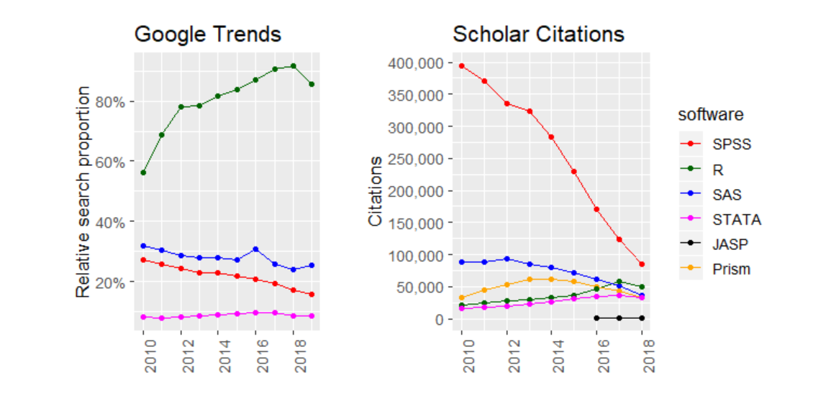

```{r setup, include=FALSE}
knitr::opts_chunk$set(echo = TRUE)
```

***

# Useful resources

https://learningstatisticswithr.com/lsr-0.6.pdf \
https://modernstatisticswithr.com/thebasics.html \
https://stat545.com/ \
Datacamp


***

# Why R?

<br>

* R is free and open-source, constantly being expanded and improved
* R is a programming language (vs SPSS: point and click)
* R makes reproducible and transparent research the norm
* R great for data wrangling and visualization
* R extremely flexible and compatible, makes collaboration easy

<br>

```{r, out.width='70%', fig.align='center', echo = F}

```

***

# Basics of R

<br>
On the right is the *console* panel which we can write any code in. But when we close R this will all be gone. Anything we want to save to run or see again we should write it in a *script*. To open a new script, click File -> New File -> R Script.
To run code in a script, press Ctrl + Enter on current line, or Ctrl + shift + Enter to run entire script.
Save it when done.
<br>

## Basic calculations

```{r}
4 + 5

12*937

2^5
```

## Variable assignment

One of the most important things to be able to do in R (or actually in any programming language) is to store information in variables. We do that using the assignment operator <-

```{r}
# This can be a single number:
x <- 5

# A so-called 'string', signified by the quotation marks:
y <- "hello"

# or a sequence of numbers, called a 'vector' and signified by the letter c followed by the contents in brackets:
z <- c(1,2,3)

x
y
z
```

More on different data 'types' later.

You can now see the variables in the Environment panel. We can remove a variable with rm() and clear the whole list with rm(list = ls()).

```{r}
rm(x)
rm(list = ls())
```

The point of variables, is that anything we can do with the information it stores (for example calculations) we can also do with the variables themselves. 

```{r}
# calculations using variables

apples <- 5
oranges <- 8

fruit <- apples + oranges
fruit

# shortcut for assignment operator: Alt -
```

If we could't do this, any calculation that we wanted to do with how many apples we have, we'd have to go through every line and change the value to 5. But with variables, we can just change the first line (e.g.`apples <- 9`), run the rest of the code unchanged and everything will be updated according to the new information. 

## Rules for names:

| Cannot start with a digit or contain certain characters such as a comma or a space
Names are case-sensitive: data is a different variable to Data which is different to DATA

Conventions include using _ or .
data_full
data.full
dataFull

To make your code more readable, you can use comments using #. without this R tries to read it as code and you get an error, so need to use # so R will ignore it.
(There is a shortcut if you want to comment out a whole section of code: highlight it and then ctrl + shift + c)

# Vectors and data frames

We'll probably want to store more than one piece of information in one variable, for this we can use a vector.
This always takes the form of c followed by brackets containing the information. 

For example:

```{r}
age <- c(29, 18, 34, 63, 56, 24, 53, 38)
```

The numbers stored in 'age' are called _elements_.
We can then easily do something to each element in the vector at once:

```{r}
age.months <- age*12
age.months
```

We can access specific elements of a vector using their index:

```{r}
age[2]
```

and change them:

```{r}
age[2] <- 28
age
```

We can combine multiple vectors into a table called a data frame:

```{r}
age.df <- data.frame(age, age.months)
age.df
```

This data.frame that we've written here is an example of a *function*, a really important tool we have in R. 

# Functions in R

Once you have some data, you actually want to do something with it. To do so, you can use a *function*. This is essentially just a ready-made set of instructions telling R what to do with the code.

```{r}
mean(age)
```

```{r}
round(3.14159)

round(3.14159, 2)
```
Here we've made use of two so-called *arguments*, which is basically the information we are suppling to the function to be more specific in what we'd like it to do.

In this function it's easy to remember which one means what, but in more complicated functions this isn't the case. That's why arguments can also have names, which allows us to specify arguments by name:

```{r}
round(x = 3.14159, digits = 2)
```

If you use argument names, it doesn't matter what order you type them in, but if you don't use names, you have to use the correct order. 
To find out what arguments a function takes:

```{r, eval = F}
?round
```

Some arguments also have default values - e.g. in the first example, if you don't specify digits it will round to nearest whole number. So round has a default digits argument of 0.

In this instance, mean is the function and age is the argument. A function can have any number of arguments from none upwards.

```{r}
height <- c(160, 163, 170, 172,175, 178, 180, 182, 185, 190, 191, 190, 166)
weight <- c(53, 60 , 58, 70,60, 78, 75, 85, 70, 88, 92, 64, 70)

cor(height, weight)
```

If you use a function incorrectly R will give you an error message. Hopefully this will be helpful in figuring out where you've gone wrong - for example, if you run a function without specifying a necessary argument:

```{r, eval = FALSE}
mean()
```

R will tell you you're missing an argument that doesn't have a default. 

# Packages

R comes with a bunch of helpful built-in functions that we don't have to do anything to already be able to use (e.g. mean or cor). But some functions exist that aren't automatically loaded and for that you need to load 'Packages'.

Packages are collections of functions and datasets that you can use in R but aren't automatically there at the beginning.

When you first use a package, you need to use 'install packages'. For example, to install the package called 'ggplot2' which we are going to use later, we can either go from the RStudio menu to Tools -> Install Packages and then type in the name, or we can use the following line of code:

```{r, eval = FALSE}
install.packages("ggplot2")
```

Whenever we want to use this package, we need to _load_ it each time we start a new R session, like this:

```{r}
library(ggplot2)
```

We are then ready to use the functions contained in this package.

If you try to run a function without the necessary package loaded, you'll get an error message saying "could not find function...". 
If you don't know what package the function came from, you can usually find out by Googling R followed by the function name or on a site like https://www.rdocumentation.org/

For example, str_c is a function in the stringr package that combines multiple strings together, with an argument sep that specifies what (if any) characters will separate them.

```{r, eval = FALSE}
first.name <- "John"
second.name <- "Smith"
str_c(first.name, second.name, sep = " ")
```

This will give us an error until we load the package that str_c belongs to: stringr


```{r}
library(stringr)
first.name <- "John"
second.name <- "Smith"
str_c(first.name, second.name, sep = " ")
```


You might also sometimes see something like psych::alpha(), which means the alpha function from the psych package. 

This is useful as sometimes multiple packages will each have a function with the same name and this avoids ambiguity to R and the reader.


# Workspace and working directory

At some point you will want to leave R and maybe come back to it later. Or run multiple analyses that you want to keep separate. Or communicate your analyses in R to the outside world.

You need somewhere to store your work in R, preferably in a way that is organised and well-structured. 

You can see where this currently is (your current *'working directory'*) by typing getwd().

It's recommended to organise your work via 'Projects' - basically a folder where you will store your code, data, outputs, everything relating to a particular project you are working on.

To create a new project, click File > New Project -> New Directory -> New Project
Give it a suitable name and choose where you want to keep it. Then click 'Create Project'.

You can also create sub-directories here to have a more clearly structured project. 

# Importing Data

Where does R read your files from? If you don't specify otherwise, it's going to look in your current working directory. You can see this via getwd() and change via setwd().

```{r}
getwd()
```

Let's start by thinking about how to import data that is in your working directory. In my working directory I have a couple of example data sheets.

To import an excel sheet, you first need to install and load the readxl package.

```{r}
imported.csv <- read.csv("example csv.csv")

library(readxl)
imported.xl <- read_xlsx("example excel.xlsx")

imported.inquisit <- read.delim("example inquisit.iqdat")
```

You can have a look at your imported data sets either by clicking on them in the Environment, or using the View() function.
The str() function will also give you more information about what variables are in your data set.

```{r, eval = F}
View(imported.csv)
str(imported.csv)
```

If the file is not in your working directory, you will get an error message

```{r, eval = FALSE}
import_nonexistent_data <- read.csv("doesnt exist.csv")
```

Tips: make sure you add the file extension and there are no typos.

What if the data set is not in your working directory?
One option is to use file_choose() or select it from the Files panel in RStudio.

```{r, eval = FALSE}
imported.csv2 <- read.csv(file.choose())
```

Or if you have data in a sub-folder in your directory, you can specify the _file path_ from the working directory. Here, I have dataset1 in a subfolder called 'inquisit data', so I tell R to look in this folder, then write a /, then as before write the name of the file with the file extension:

```{r}
imported.inquisit2 <- read.delim("inquisit data/dataset1.iqdat")
```


```{r read Inquisit data, include = FALSE}

# create empty dataframe

data_all <- NULL

# list all the files that are in a folder:
data_files <- list.files("inquisit data")
data_files

# create a for loop to read in each of these files
for (i in 1:length(data_files)) {
  data_subject_i <- read.delim(paste0("inquisit data/",
                                      data_files[i]))
  data_all <- rbind(data_all, data_subject_i)
}

```


